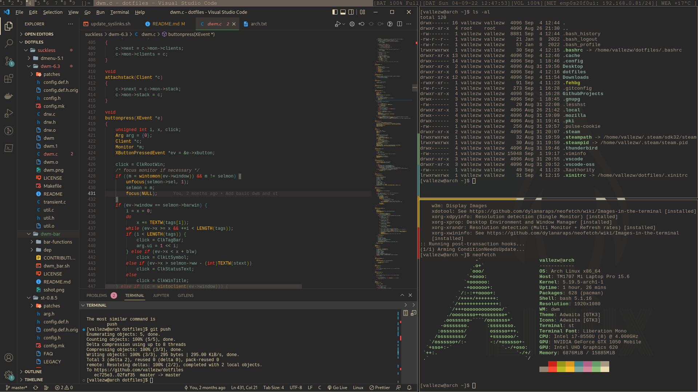

# dotfiles
In this linux installation I try to stay as lightweight as possible and using mainly suckless utilties such as dwm, st etc. Also I'm using the gruvbox dark theme.
 

## What is included?
- [dwm](https://dwm.suckless.org/) as the twm
- [dmenu](https://tools.suckless.org/dmenu/) as searchbar
- [st](https://st.suckless.org/) as the terminal
- [dwmbar](https://github.com/thytom/dwmbar)

## Getting Started
To get started you need a successfull Xorg installation and can then compile dwm, st and dmenu in the `suckless/` folder. afterwards you should link the `.xinitrc` file as well as the `.bashrc` file. For that you simply have to run the `update_syslinks.sh` script. 

## Dependencies
Dependencies you should have installed:
- feh
- picom
- dbus
- the dependencies in the `suckless/dwm-bar/dep` fodler if you want to enable the status bar